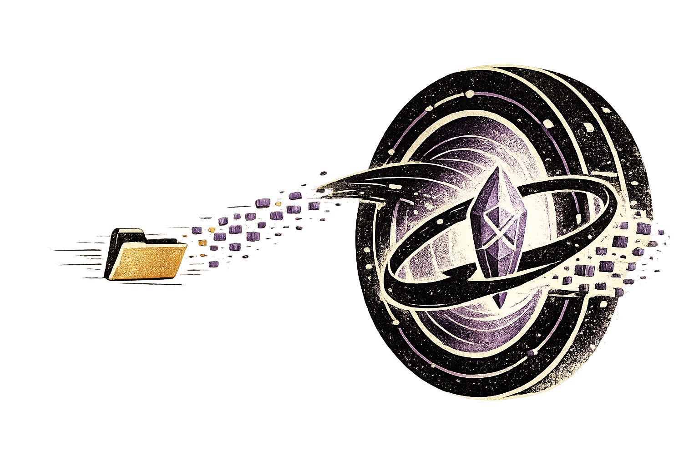

<div align="center">
  
  <br/>
  <p><b>A blazingly fast, serverless, end-to-end encrypted P2P file-transfer suite.</b></p>
  
  <p>
    <a href="https://github.com/VesperAkshay/dropwire/releases"></a>
    <a href="https://github.com/VesperAkshay/dropwire/actions"></a>
    <a href="https://github.com/VesperAkshay/dropwire/blob/main/LICENSE"></a>
  </p>
  
  
  
  <br/>
  <p>🌐 <b>Website & Docs: <a href="https://dropwire.tyes.dev">https://dropwire.tyes.dev</a></b></p>
</div>

DropWire lets you securely send files and massive directories of any size directly between machines over the internet using a simple code phrase. No accounts, no port-forwarding, and absolutely no limits. Inspired by `magic-wormhole` and `croc`, but architected for maximum bandwidth multiplexing and vast repository transfers.

Now featuring both a blazing fast **Command Line Interface (CLI)** and a gorgeous, interactive **Terminal User Interface (TUI)** (`dropwirex`).

---

## ✨ Features

- **Zero-Copy Engine:** DropWire maps files directly into memory and securely streams them with zero-copy I/O and asynchronous multithreading, maxing out your disk and network throughput.
- **Continuous Virtual Chunking:** Send 100,000 tiny files just as seamlessly (and fast) as a single 100GB video file.
- **End-to-End Encrypted (E2EE):** Every byte is symmetrically encrypted via `ChaCha20Poly1305`. The network (and the fallback relay) cannot read your data. [Read our Security Architecture](./SECURITY.md).
- **Resilient & Resume-ready:** Internet dropped at 99%? Just rerun the command. DropWire reads its deterministic `.dwstate` and resumes instantly where it left off.
- **NAT Traversal & LAN Discovery:** Attempts direct P2P first, seamlessly discovering peers on the same LAN for gigabit speeds. If both users are behind strict NATs/firewalls, traffic is securely routed through a relay—but the relay remains completely blind to the contents.

## 🎨 DropWire TUI (`dropwirex`)
DropWire now comes with a rich, interactive Terminal User Interface featuring:
- **Interactive File Browser:** Navigate your directories and toggle multiple files/folders at once with `[Space]`.
- **Live Transfer Dashboard:** Watch a live sparkline chart visualizing your transfer speeds, complete with granular progress bars for chunks and total bytes.
- **Transfer History:** Easily track everything you've sent and received over time.
- **Custom Theme Engine:** Choose your aesthetic (Cyberpunk, Matrix, Nord, Monochrome) directly from the built-in Config Editor.

## 📦 Installation

### From Source (CLI & TUI)
Ensure you have [Rust](https://rustup.rs/) installed, then run:

```bash
# Install the core CLI tool
cargo install --path ./dropwire

# Install the interactive TUI
cargo install --path ./dropwire-tui
```

## ⚡ Usage

### Using the CLI (`dropwire`)

**To send a folder:**
```bash
dropwire send /path/to/your/folder
```

**To receive:**
```bash
dropwire receive 7-purple-monkey
```

📖 **[View the full Commands Reference](./COMMANDS_REFERENCE.md)** for advanced options like custom codes, parallel streams, and self-hosted relays.

### Using the TUI (`dropwirex`)

Just run the app:
```bash
dropwirex
```
Navigate with arrow keys. Use `[Space]` to select multiple files, `[S]` to send, `[R]` to receive, `[C]` to configure, and `[H]` to view history.

## 🔒 Security Architecture

Security isn't an afterthought—it's the foundation of DropWire. We utilize SPAKE2 for zero-knowledge key exchange and ChaCha20Poly1305 for all payload encryption, paired with strict memory bounds and BLAKE3 integrity hashing.

🛡️ **[Read the complete Security Architecture document](./SECURITY.md)** for an in-depth breakdown of our cryptographic hardening.

## 🤝 Contributing

We highly encourage community feedback, bug reports, and feature requests. Please note that DropWire is closed source and we do not accept external pull requests at this time.

📝 **[Read the Contributing Guidelines](./CONTRIBUTING.md)**

## 📜 License

This software is Proprietary and Closed Source. See the **[LICENSE](./LICENSE)** file for more information.
