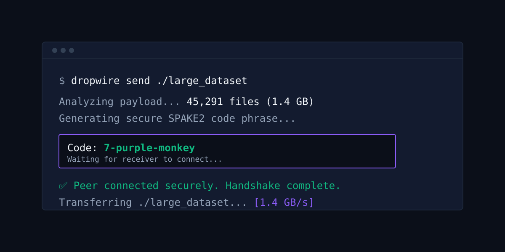

<div align="center">
  <h1>DropWire ⚡</h1>
  <p><b>A blazingly fast, serverless, end-to-end encrypted P2P file-transfer CLI.</b></p>
  
  <p>
    <a href="https://github.com/VesperAkshay/dropwire/releases"></a>
    <a href="https://github.com/VesperAkshay/dropwire/actions"></a>
    <a href="https://github.com/VesperAkshay/dropwire/blob/main/LICENSE"></a>
  </p>
  
  
</div>

DropWire lets you securely send files and massive directories of any size directly between machines over the internet using a simple code phrase. No accounts, no port-forwarding, and absolutely no limits. Inspired by `magic-wormhole` and `croc`, but architected for maximum bandwidth multiplexing and vast repository transfers.

---

## ✨ Features

- **No Accounts or Setup:** Just install and use. Authentication is based on a zero-knowledge proof derived from a shared secret code phrase.
- **Continuous Virtual Chunking:** Send 100,000 tiny files just as seamlessly (and fast) as a single 100GB video file.
- **End-to-End Encrypted (E2EE):** Every byte is symmetrically encrypted via `ChaCha20Poly1305`. The network (and the fallback relay) cannot read your data.
- **Resilient & Resume-ready:** Internet dropped at 99%? Just rerun the command. DropWire reads its deterministic `.dwstate` and resumes instantly where it left off.
- **NAT Traversal:** Attempts direct P2P first. If both users are behind strict NATs/firewalls, traffic is securely routed through a relay—but the relay remains completely blind to the contents.

## 📦 Installation

### macOS / Linux (Homebrew)
*Coming soon...*

### Windows (Scoop)
*Coming soon...*

### From Source
Ensure you have [Rust](https://rustup.rs/) installed, then run:

```bash
cargo install --git https://github.com/VesperAkshay/dropwire.git
```

## ⚡ Usage

### Sending Files

To send a file or an entire directory:

```bash
dropwire send /path/to/your/folder
```
The CLI will instantly generate a simple code phrase (e.g., `7-purple-monkey`). Share this securely with the receiver.

### Receiving Files

On the receiving machine, just type:

```bash
dropwire receive 7-purple-monkey
```
By default, the files will securely download into your `Downloads/Dropwire` directory. 

You can also specify a custom output directory:

```bash
dropwire receive 7-purple-monkey --out-dir /path/to/destination
```

## 🔒 Security Architecture

Security isn't an afterthought—it's the foundation of DropWire.

* **Key Exchange (SPAKE2):** Ensures that even if an attacker intercepts the entire handshake, they cannot brute-force the password offline. 
* **Stream Encryption (ChaCha20Poly1305):** Authenticated encryption for all transferred data and protocol messages.
* **Path Traversal Protection:** Absolute paths and nested directory escapes (e.g., `../../etc/passwd`) are strictly neutralized upon unpacking.
* **Memory Bounds:** Hard limits on metadata manifests completely defeat compression bombs and memory exhaustion attacks.
* **Integrity:** Uses BLAKE3 hashes to mathematically verify data chunk-by-chunk and upon final completion.

## 🤝 Contributing

Contributions are always welcome! Feel free to open an issue or submit a pull request.

1. Fork the Project
2. Create your Feature Branch (`git checkout -b feature/AmazingFeature`)
3. Commit your Changes (`git commit -m 'Add some AmazingFeature'`)
4. Push to the Branch (`git push origin feature/AmazingFeature`)
5. Open a Pull Request

## 📜 License

Distributed under the MIT License. See `LICENSE` for more information.
