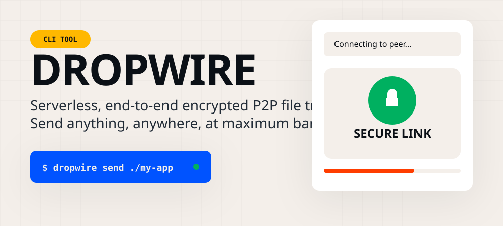
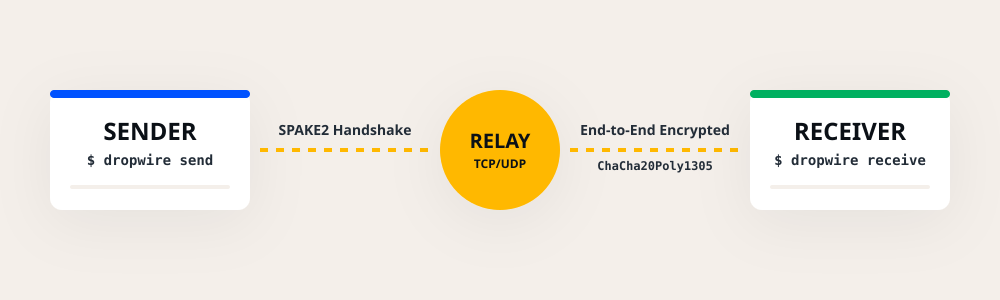

<div align="center">
  
</div>

# DropWire

**A blazingly fast, serverless, end-to-end encrypted P2P file-transfer CLI.**

DropWire lets you securely send files and massive directories of any size directly between machines over the internet using a simple code phrase. No accounts, no port-forwarding, and absolutely no limits.

---

## 🚀 How it Works

DropWire establishes a peer-to-peer connection utilizing **SPAKE2** for secure password-authenticated key exchange and encrypts everything in transit using **ChaCha20Poly1305**. It dynamically multiplexes data streams and bounds them tightly via a parallel transfer engine.

<div align="center">
  
</div>

---

## ✨ Features

- **No Accounts or Setup:** Just install and use. Authentication is based on a zero-knowledge proof derived from a shared secret code phrase.
- **Continuous Virtual Chunking:** Capable of handling massive repositories, transferring 100,000 tiny files just as seamlessly as a single 100GB video file.
- **End-to-End Encrypted (E2EE):** Every byte is symmetrically encrypted via ChaCha20Poly1305. The network (and the fallback relay) cannot read your data.
- **Resilient & Resume-ready:** Internet dropped at 99%? Just rerun the command. DropWire will read its deterministic `.dwstate` and resume instantly where it left off.
- **NAT Traversal (Fallback Relay):** Attempts direct P2P first. If both users are behind strict NATs/firewalls, traffic is securely routed through a relay—but the relay remains completely blind to the contents.

---

## 📦 Installation

### From Source
Ensure you have [Rust](https://rustup.rs/) installed, then run:

```bash
cargo install --path .
```

*Binary releases for Windows, macOS, and Linux are coming soon!*

---

## ⚡ Usage

### Sending Files

To send a file or an entire directory:

```bash
dropwire send /path/to/your/folder
```
The CLI will generate a simple code phrase (e.g., `4-purple-monkey`). Share this securely with the receiver.

### Receiving Files

On the receiving machine, just type:

```bash
dropwire receive 4-purple-monkey
```
By default, the files will securely download into your `Downloads/Dropwire` directory. 

You can also specify a custom output directory:

```bash
dropwire receive 4-purple-monkey --out-dir /path/to/destination
```

---

## 🔒 Security Architecture

Security isn't an afterthought—it's the foundation of DropWire.

* **Key Exchange:** Utilizes **SPAKE2** (Simple Password-Authenticated Key Exchange). This ensures that even if an attacker intercepts the entire handshake, they cannot brute-force the password offline.
* **Stream Encryption:** Powered by **ChaCha20Poly1305**.
* **Path Traversal Protection:** Absolute paths and nested directory escapes (e.g. `../../etc/passwd`) are strictly neutralized.
* **Memory & Storage Bounds:** Defeats compression bombs and OOM attacks via bounded allocations.
* **Integrity Guarantee:** Uses BLAKE3 hashes to mathematically verify data chunk-by-chunk and post-transfer.

---

<div align="center">
  <br/>
  <p><i>Designed with simplicity. Built for speed. Encrypted for security.</i></p>
</div>
